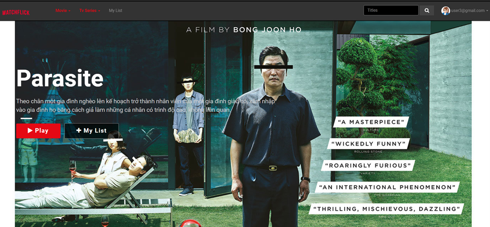

# Thành viên
- Mai Ngọc Duy - 21020512: https://github.com/AESir2412
- Lương Đình Dũng - 21021466: https://github.com/luongdzung
- Nguyễn Tiến Bắc - 21021455: https://github.com/nguyentienbac6
- Nguyễn Đình Thành Đạt - 21021476: https://github.com/ndtd128
- Nguyễn Huy Dũng - 21020612: https://github.com/ngdung2511

# Bài tập lớn CNPM - Hệ thống website xem phim trực tuyến WatchFlick

Trong bài tập lớn này, nhóm em đã dựa vào các kiến thức đã học mông Công nghệ phần mềm làm nền móng xây dưng, đi kèm với các kiến thức xây dựng web để xây dựng Hệ thống website xem phim trực tuyến WatchFlick

Trên đây là hình ảnh mô phỏng giao diện web xem phim.

## Giới thiệu
  Trong xã hội ngày nay, cùng với sự phát triển chung của toàn xã hội, nhu cầu của con người về các mặt trong đời sống cũng ngày một tăng cao. Từ những nhu cầu đơn giản nhưng mật thiết hằng ngày về lương thực thực phẩm, quần áo,… cho tới những nhu cầu lớn hơn như về mặt thể chất, an ninh, thẩm mỹ,… tất cả đều đã và đang được xem xét, dần trở thành những mục tiêu con người hướng tới để có thể đạt tới sự hoàn thiện.

	Một trong số những nhu cầu không thể không kể đến, đó chính là các nhu cầu giải trí bằng phim ảnh, truyền hình - một sân chơi màu mỡ nhưng đầy thách thức đối với các nhà sản xuất. Covid-19 xuất hiện liên tục trong hai năm vừa qua đã làm thay đổi nhiều thói quen, hành vi của khán giản. Nếu trước đây, nếu muốn được thưởng thức các tiết mục sân khấu điện ảnh, ta phải đặt vé và đến tham dự trực tiếp các buổi trình diễn, thì giờ đây, họ có vô vàn lựa chọn cho phim chỉ qua vài nút nhấn với các thiết bị điện tử. Dịch bệnh tuy đã đem đến nhiều khó khăn, nhưng đã một phần giúp “đốt cháy” giai đoạn trên: Thời gian ở nhà tăng lên khiến người dân tìm cách chuyển đổi hình thức giải trí bằng việc theo dõi, đăng ký, sử dụng các trong mạng xã hội,… để theo dõi những bộ phim này.

	Một trong những phương thức, đặc biệt là trong cộng đồng giới trẻ, hay tìm đến trong việc giải trí trên chính là việc truy cập các website xem phim trực tuyến. Với sự phát triển của trang web như YouTube, Vimeo, Netflix, Dailymotion,…, người dùng ngày này có thể dễ dàng hưởng trọn, thưởng thức những bộ phim chiếu rạp, ti-vi mới ra gần đây nhất với chi phí rất nhỏ so với trước đây, hoặc thậm chí là hoàn toàn miễn phí.

	Hiểu được nhu cầu người dùng cũng như phát triển từ những nền tảng kể trên, chúng tôi đã phát triển ra hệ thống web xem phim trực tuyến WatchFlick với mong muốn có thể áp dụng được những kiến thức công nghệ thông tin đã học để xây dựng một trang web giúp người dùng dễ dàng tận hưởng những thước phim hay và mới nhất hiện có trên thị trường, qua đó đem lại một thời gian giải trí vui vẻ, cũng như thúc đẩy, mở rộng hóa tên tuổi của những bộ phim thịnh hành ngày nay.

	WatchFlick được thiết kế dưới dạng một website, vì vậy dễ dàng chạy được ở bất kì loại thiết bị điện tử thông minh nào, từ điện thoại đến máy tính cá nhân. Chỉ cần có kết nối Internet, người dùng có thể tìm kiếm, thưởng thức những bộ phim mình mong muốn. Ngoài ra, phần mềm còn hỗ trợ một số hoạt động như thêm vào danh sách yêu thích, tìm kiếm theo chủ đề,… tất cả với mong muốn đem lại cho người dùng khoảng thời gian tốt nhất khi xem phim tại trang web.

	Đối tượng người dùng chúng tôi hướng đến ở đây là bất cứ ai có khả năng truy cập website thông qua các thiết bị điện tử và có mong muốn xem phim. WatchFlick hiện tại hỗ trợ 2 loại ngôn ngữ chính là Tiếng Việt và Tiếng Anh, và cho phép mở rộng thêm nhiều loại ngôn ngữ khác nhau phù hợp với người dùng.

## Repository này chứa 
- Bản báo cáo dạng Doc (142 trang)

- Bản báo cáo dạng PDF (142 trang)

- Slide thuyết trình

- Video Demo sản phẩm: 
Link: https://drive.google.com/file/d/1c6ebZECrmatTo8FEPoIv_Q6_hkxI5Jdm/view?fbclid=IwAR20yfxdB01mE-0Ao3fK_VOI50aR2WOzajzLkyPNBtdruFQTKOvZBDvSPa0

- và cái README.md bạn đang đọc :D 

